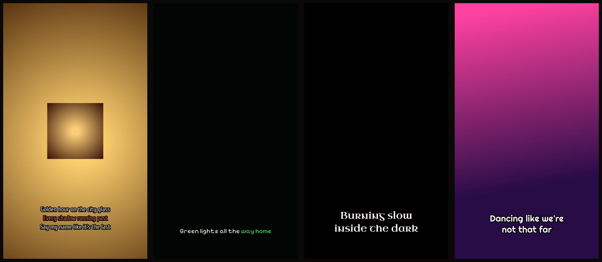
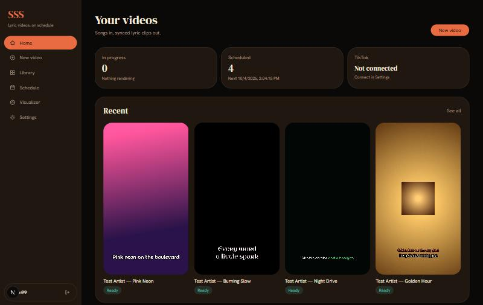
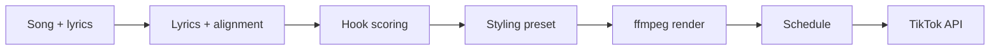

# SSS — songs in, lyric videos out

Drop in a song. SSS finds the hook, renders a synced lyric video, and posts it to TikTok on schedule.



No editing timeline. It scores the song for its strongest 30–60 seconds, times every line to the audio, and renders a 1080×1920 clip in one of 16 looks.



**[Live UI →](https://tik-tok-lyric-video-pipeline.vercel.app)** (frontend only; the pipeline runs locally) · Python · FastAPI · ffmpeg · Next.js

---

## What it does

- **Finds the hooks.** Scores repeated lines, loudness and musicality to pick non-overlapping 30–60 s moments
- **Renders vertical clips** with ASS subtitles timed to the audio, through ffmpeg + libass
- **16 looks** (color, font, lyric motion, layout), or "Surprise me" for a new one every clip
- **Schedules and posts** through TikTok's official Content Posting API
- **Built-in visualizer:** [VISUALICER](https://github.com/iice257/VISUALICER) runs inside the app, and its themes are the same 16 looks

Only use audio you have the rights to post.

## How it works



Two layers share one repo:

- **Pipeline library** (`src/tiktok_lyric_pipeline`): stateless stages, runnable on its own via `run_pipeline.py`.
- **Platform** (`src/tiktok_platform*`, `apps/web`): FastAPI API, a polling worker that claims render and upload jobs with leases, idempotency keys and retries, SQLAlchemy + Alembic, and a Next.js control panel. Every state change is logged to an append-only event table.

More in [docs/ARCHITECTURE.md](docs/ARCHITECTURE.md).

## Run it

Needs Python 3.11+, Node.js and ffmpeg.

```bash
pip install -e .
cd apps/web && npm install
```

Start the API, worker and web app with `scripts/dev-no-docker.ps1`, then open http://localhost:3000. Tests: `python -m pytest`.

## Built with

Python, FastAPI, SQLAlchemy, Alembic, ffmpeg + libass, Next.js, React, Tailwind CSS, Docker.

MIT © [Kingsley Aremu](https://github.com/iice257)
